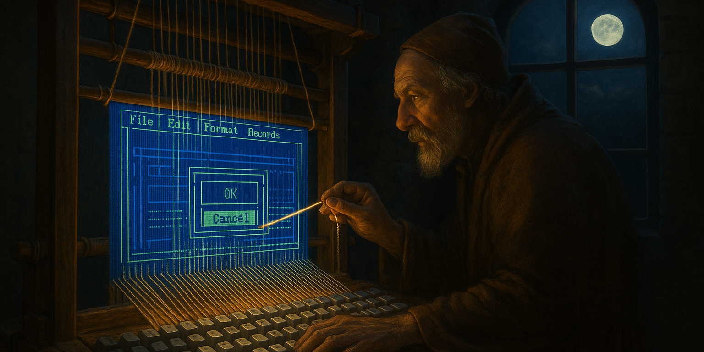

# Dan's Consoluna Library

&nbsp;

**Current Status:** Basic IO is working at the Character layer where formatted characters are rendered from the buffer. Currently in-progress on the Shape layer, where shapes, bordered boxes, and patterns are defined.

&nbsp;

Consoluna is a full-featured, easy-to-use, event-driven, cross-platform Terminal UI function library for use in character-mode applications that need a rich, colorful, full-screen layout with full control over keyboard, mouse, and screen resize detection.

Because this library is completely compatible with the built-in .NET System.Console, you retain control over your previous console application input / output techniques while simultaneously gaining a wealth of new features.

&nbsp;

## Target Systems

This library is compatible for use on Windows, Linux, Unix, and Mac console and terminal applications.

&nbsp;

## Input Functionality

On the input side, you can either poll directly for a keyboard, mouse, or screen size change in non-blocking mode, wait for a specific filter to be fulfilled in blocking mode, or register events to be notified when input has been received.

&nbsp;

## Output Functionality

The Consoluna output library is split into two layers accessible to the public, Shape and Character.

At the shape layer, a loose list is maintained containing references to conceptual elements like AsciiArt, String, Box, Button, List, etc., that are currently assigned to the screen.

The character layer is a two dimensional array of extended characters representing a backing cache of the specific information for every character assigned to the screen. Any changes made at the character layer after a change to a corresponding shape element will override the output of the shape feature until that specific shape feature is updated again, or *bumped*.

Elements on each layer are able to fire events when changed and all of the elements can be stored in working references for your own use. This means that you could either register to receive an event when either a shape or a character's contents have been changed, or you could keep your application runtime organized by keeping a reference to a shape item in your backing application so that whenever you reposition that object or change its text content locally, the console is automatically updated.

&nbsp;

## Known Limitations

<b>.NET Version 8+ Required</b>

Keyboard and mouse input on Linux, Unix, and Mac are generously provided by MV10/dotnet-curses, which uses .NET 8 to resolve a previous issue with resolving the current host platform. If you need to have that choice reconsidered in favor of .NET Standard support, please create an issue at the \[dotnet-curses Issues page\](https://github.com/MV10/dotnet-curses/issues).

&nbsp;

<b>Visual Studio Launch + Windows Subsystem for Linux</b>

This library is known not to function well in a Visual Studio -&gt; WSL debugging session because of the limitations imposed by Visual Studio itself when rerouting the standard input device away. However, the library has been tested and works fine when WSL has been started from the Command Prompt or from within Windows Terminal (wt.exe).

&nbsp;

<b>JetBrains Rider Launch</b>

Similar limitations have also been experienced when launching this library from within a JetBrains Rider development environment.

In this scenario, you can work around the limitation by selecting the **Launch** toolbar button dropdown, selecting **Edit Configurations**, and checking the option **Use external console**. In that configuration, Rider will create a terminal window separately then attach to that process when debug is starting up.
